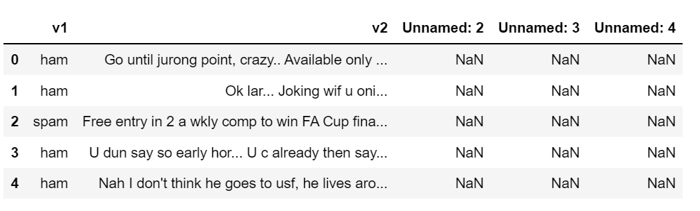
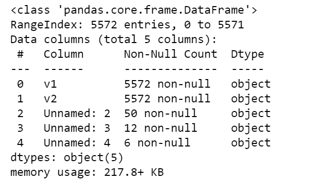
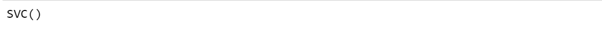
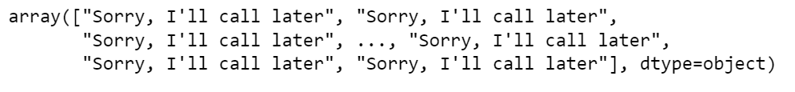
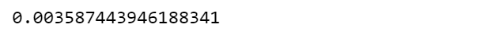

# Implementation-of-SVM-For-Spam-Mail-Detection

## AIM:
To write a program to implement the SVM For Spam Mail Detection.

## Equipments Required:
1. Hardware – PCs
2. Anaconda – Python 3.7 Installation / Moodle-Code Runner

# Algorithm

## STEP 1: 

Import the required packages.

## STEP 2:

Import the dataset to operate on.

## STEP 3:

Split the dataset.

## STEP 4: 

Predict the required output.

## STEP 5:

End the program.

## Program:
```python

Program to implement the SVM For Spam Mail Detection.


Developed by: Monisha T
RegisterNumber:  212221240029


import pandas as pd
data=pd.read_csv("spam.csv",encoding='latin-1')
data.head()
data.info()
data.isnull().sum()
x=data["v1"].values
y=data["v2"].values
from sklearn.model_selection import train_test_split
x_train,x_test,y_train,y_test=train_test_split(x,y,test_size=0.2,random_state=0)
from sklearn.feature_extractiaon.text import CountVectorizer
cv=CountVectorizer()
x_train=cv.fit_transform(x_train)
x_test=cv.transform(x_test)
from sklearn.svm import SVC
svc=SVC()
svc.fit(x_train,y_train)
y_pred=svc.predict(x_test)
y_pred
from sklearn import metrics
accuracy=metrics.accuracy_score(y_test,y_pred)
accuracy


```

# Output:

## Data_head():



## Data_info:



## Data_isnull()_sum():


## SVC_fit:



## y_pred:



## Accuracy:




## Result:
Thus the program to implement the SVM For Spam Mail Detection is written and verified using python programming.
